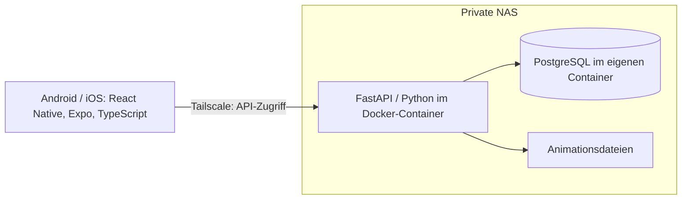

# DV-Konzept: p0008-train-me

**Stand:** 18.09.2026

**Status:** Projektgrundlage für die Sport-App; Anwendung noch nicht implementiert

Dieses Dokument ist die verbindliche Beschreibung von Projektziel, Architektur,
Entwicklung und Betrieb. Grundlage ist das
[Sport-App-Gesamtkonzept](raw-materials/sport_app_gesamtkonzept_implementierungsleitfaden.md).
Das Rohmaterial bleibt als ursprüngliche Eingabe erhalten. Verbindliche
Weiterentwicklungen werden hier und in den jeweiligen Feature-Artefakten gepflegt.

Die [Constitution](../.specify/memory/constitution.md) und die
[Arbeitsregeln](../AGENTS.md) gelten übergeordnet. Die im Rohmaterial vorgeschlagenen
separaten Architektur- und Implementierungsdokumente werden durch dieses
DV-Konzept und `specs/<nummer>-<name>/` abgedeckt. Beispiele für Felder,
API-Routen, Rollen und Verzeichnisse sind noch keine beschlossenen Detailverträge.
Offene Entscheidungen und der Bearbeitungsstand des ersten Arbeitspakets
sind ausdrücklich gekennzeichnet.

## Inhalt

- [Projektziel](#projektziel)
- [Aktueller Projektstand](#aktueller-projektstand)
- [Fachlicher Umfang](#fachlicher-umfang)
- [Architektur](#architektur)
- [Daten und Schnittstellen](#daten-und-schnittstellen)
- [Einrichtung](#einrichtung)
- [Entwicklung](#entwicklung)
- [Erster Funktionsumfang](#erster-funktionsumfang)
- [Offene Entscheidungen](#offene-entscheidungen)
- [Betrieb](#betrieb)
- [Wissensaustausch](#wissensaustausch)
- [Weiterentwicklung und Versionen](#weiterentwicklung-und-versionen)
- [Prüfstatus](#prüfstatus)
- [Quellen](#quellen)

## Projektziel

`p0008-train-me` wird eine privat genutzte Sport-App für Android und iOS.
Mehrere Personen erhalten getrennte Trainingsprofile mit eigenen Zielen,
Einschränkungen, Equipment und Präferenzen. Die App zeigt geplante Trainings
und führt mit Animationen, Timer, Pausen und gesprochenen Hinweisen durch
eine Einheit. Ergebnisse und Feedback unterstützen die spätere Trainingsplanung.

Der normale App- und Trainingsbetrieb benötigt keine KI-Aufrufe und verursacht
keinen laufenden KI-Tokenverbrauch. KI-Werkzeuge unterstützen außerhalb der
App die Entwicklung, die Erstellung und Pflege von Übungen sowie Vorschläge
für neue Trainingspläne. Sie arbeiten mit exportiertem Kontext und Entwürfen.
Eine fachliche Prüfung und Freigabe gehen der produktiven Nutzung voraus.

Ziel ist ein nachvollziehbarer Trainingsablauf mit möglichst wenig Bedienung
während einer Einheit. Die Entwicklung erfolgt in kleinen, überprüfbaren
Arbeitspaketen mit manueller Sichtprüfung und Abnahme.

## Aktueller Projektstand

Das Repository enthält bislang das übernommene Template und seine Werkzeuge.
Die folgende Zielarchitektur beschreibt den geplanten Ausbau.

| Bereich | Vorhandener Stand |
| --- | --- |
| Projektregeln | Constitution 1.1.0, AGENTS.md und Feature-Vorlagen vorhanden |
| Spec Kit | Integration 1.0.7 für Codex mit PowerShell-Skripten; Skills unter `.agents/skills/` |
| Entwicklungscontainer | Python-Basis und Service `dev`; keine Anwendungsdienste aktiviert |
| Projektmetadaten | `config/project.yaml` enthält noch `name: template-spec-kit`, `kind: template`, `stack: none` und `services: []` |
| Referenzmaterial | Generator, Technologieprofile und API-Rezept unter `scripts/` und `templates/` |
| Bisheriges Feature | `specs/001-template-foundation/` dokumentiert das übernommene Grundgerüst |
| Erstes Anwendungsfeature | [002 – Backend-Grundgerüst](../specs/002-backend-foundation/spec.md) spezifiziert und [technisch geplant](../specs/002-backend-foundation/plan.md); Aufgaben und Umsetzung stehen aus |
| Prüfungen und CI | Template-Tests und CI für erzeugte Beispielprojekte |
| Sport-App | Noch keine mobile Anwendung, kein projektspezifisches Backend und keine produktive Datenbank |

Die Umstellung von Metadaten, Anwendungsverzeichnissen, Abhängigkeiten,
Devcontainer und CI ist im ersten technischen Feature gemeinsam geplant.
Die bestehenden Generatorfunktionen bleiben auch beim Ausbau erhalten. Ein erfolgreicher
Template-Test belegt noch keine lauffähige Sport-App.

## Fachlicher Umfang

### Umfang des MVP

Der MVP umfasst die folgenden Fähigkeiten aus dem Rohkonzept. Er wird über
mehrere Features aufgebaut; die Tabelle beschreibt keine bereits fertigen Funktionen.

| Bereich | Übernommene Anforderungen | Rohkonzept |
| --- | --- | --- |
| Benutzer und Profile | Technische Anmeldung und Trainingsprofil unterscheiden; mehrere getrennte Profile, Ziele, strukturierte Einschränkungen, Equipment, Trainingszeiten und bevorzugte Dauer; profilbezogene Rechte | Abschnitte 3, 4, 16 |
| Übungskatalog | Eindeutige IDs, Kategorie, Zielmuskulatur, Schwierigkeit, Equipment, Dauer oder Wiederholungen, Standardpause, Animation, Sprachhinweise, Anleitung, typische Fehler, Alternativen und Aktivstatus | Abschnitte 5–7 |
| Trainingsplanung | Profilgebundene Tages-, Wochen-, Mehrwochen- und Monatsplanung; Entwurf, Prüfung, Freigabe, Aktivierung und Archivierung | Abschnitte 8, 13 |
| Trainingsplayer | Heutige Einheit, Vorbereitung, Animation, Timer, Pausen und automatischer Übungswechsel; Pause/Fortsetzen, Überspringen, Abbrechen und Feedback | Abschnitt 9 |
| Sprache | Systemeigene Text-to-Speech-Ausgabe für zeitgesteuerte Hinweise und Countdowns; gesprochenes Feedback mit Transkription | Abschnitte 7, 10 |
| Historie und Feedback | Tatsächlichen Trainingsverlauf speichern; persönliches Trainingsfeedback und Qualitätsfeedback zur App oder Übung getrennt behandeln | Abschnitte 10, 11, 14 |
| Austausch mit KI-Werkzeugen | Standardisierter AI-Context-Export; validierte Planvorschläge als DRAFT importieren, prüfen und freigeben | Abschnitte 12, 13 |
| Privater Betrieb | Backend und PostgreSQL auf der NAS, Zugriff über Tailscale, zusätzliche Anwendungsrechte und wiederherstellbare Sicherungen | Abschnitte 2, 16–18 |

Vorgesehene Ansichten sind Heute, Trainingsplayer, Wochen-/Monatsplan,
Übungskatalog, Profil und Historie. Verwaltungsfunktionen für Übungen, Import
und Freigabe sind Administratoren vorbehalten; ihre konkrete Oberfläche ist offen.

### Fachliche Regeln

- Profile und ihre Pläne, Historien und persönlichen Rückmeldungen bleiben
  getrennt. Ein Benutzer kann Trainingsprofile besitzen; Administratoren
  können mehrere Profile verwalten. Die genaue Zuordnung wird spezifiziert.
- Einschränkungen werden strukturiert gespeichert und beim Export mitgegeben.
  Sie haben bei Planvorschlägen Vorrang und dürfen nicht automatisch entfernt
  werden. Vorschläge berücksichtigen das verfügbare Equipment.
- Neue KI-generierte Übungen und Pläne entstehen als Entwurf. Eine
  automatische produktive Freigabe ist ausgeschlossen. Animationen werden
  vor ihrer Freigabe auch visuell geprüft.
- Der Player läuft ohne Bestätigung nach jeder Übung weiter. Ein
  Feedback-Button ermöglicht eine kontrollierte Rückmeldung; ohne Betätigung
  läuft das Training weiter. Wiederholen ist im Rohkonzept nur optional.
- Persönliches Feedback kann Belastung, Eignung, Pausen und Trainingsdauer
  bewerten und Freitext enthalten. Qualitätsfeedback verändert nicht
  automatisch einen persönlichen Trainingsplan.
- Bei Spracheingabe wird vorzugsweise die Transkription gespeichert.
  Eine dauerhafte Audioaufbewahrung ist standardmäßig nicht vorgesehen.
- Folgepläne berücksichtigen Historie und individuelles Feedback. Progression
  erfolgt schrittweise und nachvollziehbar; negative Rückmeldungen führen
  eher zu Reduktion oder Alternativen. Konkrete Regeln bleiben zu spezifizieren.

### Abgrenzung

Zum MVP gehören keine direkten KI-Abfragen aus der mobilen App, kein
MCP-Direktzugriff auf Produktivdaten, keine automatische Planfreigabe,
keine öffentliche Bereitstellung für beliebige Nutzer, kein komplexes
Social-System, keine automatische medizinische Bewertung und keine
vollständige Gamification.

Offline-Synchronisation, öffentliche Registrierung, Push-Nachrichten,
Kalender, Wearables, Herzfrequenzdaten, weitergehende Statistiken,
gemeinsames Training und eine Coach-Rolle sind spätere Möglichkeiten.
Auch eine zusätzliche Textanzeige der gesprochenen Hinweise ist im Rohkonzept
erst später vorgesehen. KI-Unabhängigkeit legt noch keinen vollständigen
Offlinebetrieb fest; das Verhalten bei Netzausfall bleibt offen.

## Architektur

### Systemkontext und Zielarchitektur



Die mobile App greift ausschließlich über FastAPI auf Anwendungsdaten zu.
Die Datenbank wird nicht öffentlich bereitgestellt. Der Zugriff auf die
private Infrastruktur erfolgt zunächst über Tailscale; die API prüft zusätzlich
Anmeldung, Rolle und Profilberechtigungen. Transportabsicherung und
Medienauslieferung werden vor der ersten Bereitstellung konkretisiert.

| Komponente | Festgelegte Richtung | Noch auszuarbeiten |
| --- | --- | --- |
| Mobile App | React Native, Expo und TypeScript; gemeinsame Codebasis für Android/iOS | Versionen, Build-/Verteilungsweg, unterstützte Geräte und Betriebssysteme |
| Backend | Python 3.13/FastAPI, `backend/src/train_me_backend/`, synchrones SQLAlchemy/psycopg und Alembic geplant; NAS bleibt Betriebsziel | Implementierung, Paket-Locks, Authentifizierung, Produktionsimage |
| Datenbank | PostgreSQL 17, getrennte Entwicklungs-/Testinstanzen, Alembic-Baseline geplant | Image-Digest bei Umsetzung, fachliches Schema und produktive Betriebsparameter |
| Medien | Lottie/dotLottie, kurze skalierbare Animationen ohne Ton | Player-Bibliothek, Asset-Herkunft, Versionierung, Auslieferung |
| Sprachhinweise | Systemeigene TTS-Funktion des Smartphones | Sprachen, Zeitsteuerung und Verhalten bei Unterbrechungen |
| Sprachfeedback | Aufnahme und Speech-to-Text, bevorzugt Transkription speichern | Umsetzung und Plattformunterstützung ohne verpflichtende KI-Cloud |
| KI-Unterstützung | Exportdateien und Vorschläge außerhalb des App-Betriebs | Export-/Importschemata und Freigabebedienung |

MP4 ist nur als spätere Medienalternative vorgesehen; GIF ist kein Zielformat.
Keycloak, Prometheus und Grafana sind im Template als optionale Bausteine
vorhanden, aber für die Sport-App bislang nicht ausgewählt.

### Repository und Dokumentationszuständigkeit

Die vorhandenen Verzeichnisse behalten zunächst ihre Funktion:

| Ablage | Inhalt |
| --- | --- |
| `docs/DV_KONZEPT.md` | Verbindliches Projektziel, Architektur, Entwicklung und Betrieb |
| `docs/raw-materials/` | Ursprüngliche Unterlagen als Eingabe |
| `.specify/memory/constitution.md` | Übergeordnete Prinzipien |
| `specs/<nummer>-<name>/` | Fachliche Spec, technischer Plan, Aufgaben und gegebenenfalls Verträge |
| `config/` | Projektmetadaten und Referenzkonfiguration |
| `.devcontainer/`, `.github/` | Entwicklungsumgebung und CI |
| `scripts/`, `templates/`, `tests/` | Übernommene Werkzeuge, Bausteine und deren Tests |

Das Rohkonzept schlägt `app/`, `backend/`, `schemas/`, `examples/`,
`ai-context/` und `proposals/` vor. Für Feature 002 ist `backend/` mit
`src/train_me_backend/`, eigenen Tests und Alembic-Migrationen geplant.
Die übrige Anwendungsstruktur wird in den Folgefeatures entschieden (O-01).
Noch sind keine Anwendungsverzeichnisse implementiert. Export- und Vorschlagsdaten mit
Personenbezug gehören außerhalb versionierter Beispieldaten abgelegt.
Der Generator ist ein vorhandenes Werkzeug für leere Zielverzeichnisse;
er wird nicht zum Überschreiben dieses bestehenden Projekts eingesetzt.

### Planungsentscheidungen für Feature 002

Der [Backend-Plan](../specs/002-backend-foundation/plan.md) konkretisiert den
ersten Ausbau. Die folgenden Entscheidungen sind geplant, noch nicht umgesetzt:

- Der vorhandene Python-3.13-Entwicklungscontainer führt Backend und Tests aus.
  Docker Compose wird auf dem Windows-Host mit PowerShell gesteuert; die
  bestehende Spec-Kit-Integration bleibt dort erhalten. Linux-CI verwendet
  dieselben Anwendungscontainer. Weitere Umgebungen benötigen eigene Nachweise.
- Die Dienste `postgres` und `postgres-test` verwenden PostgreSQL 17 mit
  getrennten Zugangsdaten und eingeschränkten Anwendungsrollen. Entwicklung
  erhält ein persistentes Volume, Tests einen ausdrücklich wegwerfbaren Bestand.
  DB-Ports werden nicht veröffentlicht; die lokale API bindet an Loopback-Port 8000.
- FastAPI/Uvicorn, SQLAlchemy 2, psycopg 3 und Alembic bilden das Backend.
  pip-tools erzeugt vollständig gebundene Runtime-/Testabhängigkeiten mit Hashes;
  Image-Digests und Paketpatchstände werden bei der Umsetzung tatsächlich aufgelöst.
- `GET /health` liefert ausschließlich `{"status":"ok"}` ohne Datenbankzugriff.
  Eine eigene CLI prüft `SELECT 1`, führt Migrationen aus und liest ihren Stand.
  Verbindungsprüfungen haben ein 10-Sekunden-Prozessbudget; Migrationen 30 Sekunden.
- Revision `0001_baseline` enthält keine fachlichen Tabellen. Nur ein wirklich
  ausgeführtes Alembic-Upgrade gilt als Nachweis. Tests prüfen Wiederholung,
  Datenbestandserhalt und Fehler an der getrennten Testinstanz.
- Der Generator erhält seine bisherige generische Containerbasis unter
  `templates/base/files/.devcontainer/`, damit die Anwendungsdienste nicht
  in erzeugte Beispielprojekte gelangen. Bestehende Tests und Generatorjobs bleiben.
- `python scripts/check.py` wird um Backend-/DB-/Migrationstests ergänzt.
  Fehlende Pflichtprüfungen verhindern vollständigen Erfolg; statische
  Teilprüfungen werden ausdrücklich gekennzeichnet. Ein eigener CI-Job prüft
  das Backend. Lokale Initialisierung ergänzt fehlende Werte, erhält aber
  bestehende Passwörter, Benutzerfelder und Referenzmounts.

Begründungen und geprüfte Alternativen stehen in der
[Feature-Recherche](../specs/002-backend-foundation/research.md).
Produktionsimage, NAS-Bereitstellung und fachliche Datenmodelle bleiben Folgefeatures.

## Daten und Schnittstellen

### Fachliche Datenhaltung

| Datenbereich | Inhalt und Zusammenhang |
| --- | --- |
| Benutzer | Anmeldung, Rolle und Aktivstatus; getrennt vom Trainingsprofil |
| Profil | Ziele, Einschränkungen, Equipment, Trainingsniveau und Präferenzen |
| Übung | Metadaten, Ausführung, Animation, Hinweise, Alternativen und Aktivstatus |
| Trainingsplan | Genau ein Profil, Zeitraum, geplante Einheiten, Übungen/Pausen und Freigabestatus |
| Trainingseinheit | Profil, Plan, Datum/Zeit, tatsächlich ausgeführte oder übersprungene Übungen, Dauer und Unterbrechungen |
| Feedback | Persönliche Rückmeldung mit Profil-/Session-/Übungsbezug beziehungsweise getrenntes Qualitätsfeedback |
| Medien | Dateien auf der NAS; Datenbank enthält Asset-ID, Pfad/URL und Metadaten |

Das konkrete Schema, Pflichtfelder, IDs, Einheiten und Versionen werden je
Feature definiert. Die Planstatus `DRAFT`, `APPROVED`, `ACTIVE` und
`ARCHIVED` sind das Ausgangsmodell aus dem Rohkonzept; Übergänge und
Berechtigungen werden im Planungsfeature präzisiert.

Der Player soll seinen Zustand mit Session, aktueller Übung, verbleibender
Zeit, Pausenstatus und abgeschlossenen Übungen speichern können. Regeln
für Wiederaufnahme nach App-Neustart oder Verbindungsabbruch bleiben offen.
Historische Ergebnisse müssen erkennen lassen, was tatsächlich trainiert wurde.

### API und Austauschformate

Vorgesehen sind API-Bereiche für Anmeldung, Profile, Übungen, Pläne, heutiges
Training, Sessionsteuerung, Feedback, Historie sowie Kontext-Export und
Planimport. Die Routenliste aus Abschnitt 15 des Rohkonzepts ist ein Vorschlag.
Konkrete Endpunkte, Fehlerantworten, Validierung und Zugriffsrechte werden als
Verträge im jeweiligen Feature geplant und mit Implementierungstests abgeglichen.

Ein AI-Context-Paket soll eine Erläuterung sowie strukturierte Daten zu Profil,
Zielen, Einschränkungen, Equipment, freigegebenen Übungen, aktuellem Plan,
Historie und Feedback enthalten. Der Export erlaubt externen KI-Werkzeugen
die Planung ohne direkten Produktionsdatenbankzugriff.

Der vorgesehene Ablauf ist: Export → externer Planvorschlag → Validierung und
Review → Import als DRAFT → ausdrückliche Freigabe → Aktivierung.
Ungültige oder nicht freigegebene Inhalte dürfen keinen aktiven Plan ersetzen.
Schemas, Versionsverträglichkeit, Konfliktbehandlung und Exportumfang sind offen.

## Einrichtung

### Vorhandene Arbeitsumgebung

Für die gemeinsamen Werkzeuge werden Python ab 3.11 und Git benötigt.
Im Repository:

```powershell
python -m pip install -r scripts/requirements.txt
python scripts/check.py
```

Diese Befehle richten die vorhandenen Prüfwerkzeuge ein und prüfen das
Grundgerüst. Ein Startbefehl für die Sport-App wird mit dem ersten
lauffähigen Feature ergänzt. Node-/Expo- und Backend-Abhängigkeiten sind
noch nicht als Anwendungsumgebung eingerichtet.

### Lokaler Container und Referenz-Repositories

Für den optionalen Devcontainer werden Docker mit Compose und eine
Dev-Containers-fähige Umgebung benötigt. Unter Windows auf dem Host:

```powershell
python scripts/container_init.py --references-root C:\Git
```

Danach kann das Projekt in VS Code mit „Reopen in Container“ geöffnet werden.
Das Skript erhält bestehende lokale Werte, erstellt `.env` bei Bedarf und
erzeugt lokale Passwörter für entsprechende Platzhalter. Der aktuelle Container
startet nur `dev`; Backend und PostgreSQL werden erst im technischen Feature ergänzt.

Die ignorierte `.devcontainer/local.json` merkt sich den Hostpfad.
`compose.local.yaml` bindet Referenz-Repositories unter `/references/repos`
nur lesbar ein; alternativ kann `REFERENCE_REPOS_ROOT` gesetzt werden.
Das aktuelle Projekt bleibt unter `/workspaces/project` schreibbar.
Der Container erhält keinen Host-Docker-Socket; Compose-Verwaltung erfolgt
auf dem Host. Referenzen können auf bereinigte Klone ohne lokale Secrets
beschränkt werden.

Codespaces ist im Rohkonzept als bevorzugte reproduzierbare Lauf- und
Testumgebung vorgesehen. Dort keinen Windows-Referenzpfad setzen.
Die vorhandene Konfiguration fordert für `maieuticus/*` `contents: read`
und `issues: write` an. Das ist keine Veröffentlichungsfreigabe.
Referenzklone und tatsächliche Tokenrechte sind getrennt zu prüfen.

### Spec Kit initialisieren

Spec Kit ist laut `.specify/integration.json` bereits in Version 1.0.7 für
Codex mit PowerShell und dem Aufrufseparator `-` eingerichtet.
Die Skills liegen unter `.agents/skills/speckit-*/`; die Constitution besteht.
Für dieses Arbeitsverzeichnis ist keine erneute Initialisierung erforderlich.

Der vorhandene Linux-Devcontainer und `scripts/init_speckit.py` stammen
aus dem Template; das Initialisierungsskript ist auf Bash ausgelegt.
Ein Wechsel der Entwicklungsumgebung muss die Skriptwahl berücksichtigen.
Bestehende Integration, Constitution und lokale Vorlagenanpassungen unter
`.specify/templates/overrides/` dürfen dabei nicht blind überschrieben werden.

## Entwicklung

### Ablauf je Feature

1. Relevante Anforderungen und offene Entscheidungen aus diesem Konzept lesen.
2. Ein Feature unter `specs/<nummer>-<name>/` mit überprüfbaren
   Akzeptanzkriterien spezifizieren und fachliche Unklarheiten klären.
3. Technische Umsetzung, Schnittstellen, Datenänderungen und Tests planen.
4. Aufgaben ableiten und Spec, Plan und Aufgaben auf Konsistenz prüfen.
5. Implementieren, automatisiert prüfen und in der Zielumgebung starten.
6. Funktion manuell ansehen, Rückmeldungen einarbeiten und Abweichungen dokumentieren.
7. DV-Konzept aktualisieren, Diff prüfen und das Arbeitspaket zur Abnahme vorlegen.

Die installierten Schritte sind `speckit-specify`, `speckit-clarify`,
`speckit-plan`, `speckit-tasks`, `speckit-analyze`,
`speckit-implement` und `speckit-converge`. Der letzte Schritt kann neue
Aufgaben erzeugen; anschließend sind Umsetzung und Prüfung zu wiederholen.

Der übernommene Workflow unter `.specify/workflows/project-sdd/workflow.yml`
automatisiert mehrere Schritte und endet mit einem Review. Fachliche
Unklarheiten müssen vor einem solchen Lauf geklärt sein. Der Ablauf aus
dem Rohkonzept sieht nach größeren Arbeitspaketen eine Nutzerabnahme vor,
bevor die nächste Phase beginnt. Abnahmen und Commits sind gesondert
nachzuweisen; ein erfolgreicher Agentenlauf ersetzt sie nicht.

Jeder Implementierungsauftrag nennt Umgebung, geeignetes verfügbares Modell,
Begründung, erwartetes Ergebnis sowie automatische und manuelle Prüfungen.
Konkrete Modelle werden je Arbeitspaket ausgewählt, nicht hier dauerhaft festgelegt.

### Teststrategie und gemeinsame Prüfungen

```powershell
python scripts/check.py
python scripts/check.py --static-only
```

Das Skript prüft Dokumentlinks, Anker, Python-/JSON-/YAML-Syntax und den
zentralen Dokumentationsvertrag. Anschließend führt es die Prüfungen aus
`config/project.yaml` aus: derzeit die neun Template-Tests.

Mit der Anwendung werden die folgenden Prüfungen in Aufgaben und CI ergänzt:

| Bereich | Geplante Prüfung |
| --- | --- |
| Backend | Fachlogik, API-Verträge, Eingabevalidierung, Profil-/Rollenrechte und Fehlerfälle |
| Datenbank | Reale PostgreSQL-Integration, Migrationen und nachvollziehbare Wiederherstellung |
| Mobile App | Komponenten, Navigation, Profilwechsel, API-Fehler und Datenzuordnung |
| Trainingsplayer | Zustandswechsel, Timer, Pause/Fortsetzen, Überspringen, Abbruch und Sprachzeitpunkte |
| Geräte | Animation, TTS, Mikrofon und Unterbrechungen auf vereinbarten Android-/iOS-Testgeräten |
| Austausch | Export-/Importschema, Einschränkungen, Entwurfsstatus und Freigabeschutz |
| Gesamtablauf | Profil → heutiges Training → Übung/Sprachhinweis → Pause → nächste Übung → Sprachfeedback → Abschluss → Historie |

Prüfungen verwenden synthetische oder anonymisierte Daten und getrennte
Testdatenbanken. Nicht ausgeführte Geräte-, Container-, Datenbank- oder
manuelle Tests werden ausdrücklich benannt.

### Entwicklungsfahrplan

Die Phasen aus dem Rohkonzept dienen als Reihenfolge und werden bei Bedarf
in kleinere Features zerlegt.

| Phase | Ziel und überprüfbares Ergebnis |
| --- | --- |
| 0 | Vorhandenes Grundgerüst für die App konkretisieren und in frischer Umgebung starten |
| 1 | Backend-Grundgerüst mit Health-Endpunkt, Datenbankanbindung, Migrationen und Basistests |
| 2 | Benutzer/Profile, Ziele, Einschränkungen, Equipment und Katalogdaten mit Beispieldaten verwalten |
| 3 | Übungs-API, Schema und drei bis fünf geprüfte Beispielübungen mit Lottie-Assets |
| 4 | App-Grundgerüst zeigt Profile und Beispielübungen über die API |
| 5 | Beispielplan mit Wochen-/Monatsansicht und Planstatus |
| 6 | Beispielsession mit Animation, Timer, automatischen Pausen und Abschluss |
| 7 | Sprachhinweise zu den vorgesehenen Zeitpunkten |
| 8 | Persönliches und Qualitätsfeedback einschließlich korrekt zugeordneter Spracheingabe |
| 9 | Vollständig nachvollziehbare absolvierte Trainings |
| 10 | Validierter AI-Context-Export, der ohne Datenbankzugriff verständlich ist |
| 11 | Externer vierwöchiger Testplan lässt sich als Entwurf importieren und anzeigen; Freigabeweg prüfen |
| 12 | Nachvollziehbar unterschiedliche Folgepläne aus Beispielhistorien und Feedback |

## Erster Funktionsumfang

**Spezifiziert als [002 – Backend-Grundgerüst](../specs/002-backend-foundation/spec.md):**
„Backend lokal starten und Datenbankverbindung prüfen“. Die Anforderungen
sind geprüft; [Plan und Verträge](../specs/002-backend-foundation/plan.md)
sind erstellt. Aufgaben und Umsetzung stehen noch aus.

Das Repository besitzt noch keine Anwendungsbasis. Ein kleines technisches
Arbeitspaket entsprechend Phase 1 schafft die Voraussetzung für die
anschließende fachliche Profilverwaltung. Es kann die dafür notwendigen
Restarbeiten aus Phase 0 aufnehmen. `001-template-foundation` bleibt erhalten;
das neue Feature verwendet die fortlaufende Nummer `002`.

In die Spezifikation übernommener Umfang:

- Projektspezifisches FastAPI-Backend lokal starten und `GET /health` bereitstellen.
- PostgreSQL für Entwicklung und Tests über Konfiguration anbinden.
- Migrationsverwaltung mit einer reproduzierbaren Baseline einrichten.
- Relevante API-, Datenbank- und Migrationstests in die gemeinsame Prüfung aufnehmen.
- Metadaten, Anwendungsverzeichnisse und Startanleitung auf den tatsächlich
  implementierten Umfang abstimmen.

In der Spezifikation konkretisierte Abnahmekriterien:

1. Eine frische Entwicklungsumgebung kann Backend und PostgreSQL nach der
   dokumentierten Anleitung starten.
2. `GET /health` liefert HTTP 200 und einen dokumentierten Health-Status.
   Der erfolgreiche HTTP-Aufruf allein gilt nicht als Datenbanknachweis.
3. Ein separater Integrationstest erreicht eine echte PostgreSQL-Testdatenbank.
   Ein Verbindungsfehler wird erkennbar gemeldet und nicht als Erfolg gewertet.
4. Die Migrationsbaseline lässt sich auf eine leere Testdatenbank anwenden;
   ein erneuter Lauf verursacht keine ungewollten Änderungen.
5. `python scripts/check.py` prüft die neu hinzugekommenen Bestandteile;
   ein erforderlicher, aber nicht ausgeführter Datenbanktest ist sichtbar.
6. Ein manueller Start- und Health-Test wird mit Ergebnis dokumentiert.

Dieses erste Paket umfasst noch keinen Trainingsplayer, Übungskatalog oder
KI-Workflow. Benutzerrechte und Profilfunktionen erhalten ein eigenes
Folgefeature. Als erster fachlicher Umfang bietet sich das Anlegen,
Bearbeiten und Auswählen berechtigter Trainingsprofile an; vor dessen
Umsetzung ist O-02 zu klären. Der Gesamtumfang des MVP bleibt davon unberührt.

## Offene Entscheidungen

O-01 ist für das Backend entschieden; die Mobile-Struktur bleibt offen.
O-03 ist im Backend-Plan entschieden. Die übrigen Einträge bleiben **offen**
und werden in ihren jeweiligen Features geklärt. Planungsentscheidungen sind
noch kein Nachweis einer installierten oder getesteten Umsetzung.

| ID | Gegenstand und Stand | Zeitpunkt / Folgearbeit |
| --- | --- | --- |
| O-01 | Backend unter `backend/`, Generatorentkopplung, Container-/CI-Weg und PowerShell-Spec-Kit im [Plan 002](../specs/002-backend-foundation/plan.md) entschieden; Mobile-Struktur noch offen | Backend umsetzen; Mobile-Struktur vor App-Grundgerüst |
| O-02 | Anmeldeverfahren, Benutzeranlage, Sitzungen, Rollenmatrix, Anzahl/Zuweisung von Profilen und Verwaltungsrechte; konkrete Rollennamen sind bisher Beispiele | Benutzer-/Profilfeature |
| O-03 | Python 3.13/PostgreSQL 17, Paket-Locks/Image-Digests, synchrones SQLAlchemy/psycopg, Alembic und getrennte Health-/DB-Prüfung mit Zeitbudgets entschieden | Patchstände/Digests bei Implementierung auflösen und validieren |
| O-04 | Pflichtfelder, Einheiten, Zeitzonen, Planüberschneidungen, Statusübergänge und Versionierung historischer Übungs-/Plandaten | Datenmodell und Trainingsplanung |
| O-05 | Player-Verhalten bei Hintergrundbetrieb, App-Neustart und Netzausfall; Wiederaufnahme, Wiederholungsübungen und Zusammenspiel von Timer, Animation und TTS | Trainingsplayer |
| O-06 | Speech-to-Text ohne verpflichtende KI-Cloud; Sprachen, Plattformunterstützung, Mikrofonrechte, Fehlerfälle und genaue Unterbrechung durch den Feedback-Button | Sprachfeedback |
| O-07 | Lottie-/dotLottie-Unterstützung, Asset-Erstellung und Nutzungsrechte, visuelle Prüfung, Medienauslieferung und Aktualisierung | Übungskatalog und App-Plan |
| O-08 | Exportumfang und bewusste Weitergabe persönlicher Daten an externe KI-Werkzeuge; Aufbewahrung/Löschung von Historie, Feedback, Audio und Exporten; Importkonflikte und Schema-Versionen | Personenbezogene Speicherung beziehungsweise Export-/Importfeature |
| O-09 | NAS-Plattform, Containerarchitektur, Tailscale-Zugriffsregeln, Transportabsicherung, Secrets, Backupziel/-aufbewahrung, Wiederherstellungsziele, Zuständigkeit und Überwachung | Erste NAS-Bereitstellung |
| O-10 | Unterstützte Android-/iOS-Versionen, Testgeräte, Build- und privater Verteilungsweg; messbare Qualitätsziele | App-Grundgerüst |
| O-11 | Konkrete Regeln für sichere, nachvollziehbare Belastungsanpassung unter Vorrang der Einschränkungen; Prüfung und Freigabe von Folgeplänen | Progressionsfeature |

## Betrieb

### Geplanter Anwendungsbetrieb

FastAPI und PostgreSQL sollen als getrennte Docker-Container auf der privaten
NAS laufen. Medien werden dort als Dateien gespeichert. Produktive Daten,
Testdaten und lokale Entwicklungsdaten erhalten getrennte Konfigurationen.
Konkrete Start-, Update- und Wiederherstellungsbefehle werden erst mit einem
geprüften Deployment ergänzt; derzeit existiert kein Sport-App-Deployment.

Die Anwendungsrechte müssen unabhängig vom privaten Netzwerkzugang wirksam sein.
Normale Benutzer greifen auf ihre berechtigten Profile, Trainings und
Rückmeldungen zu. Administratoren verwalten Profile, Übungen und Planfreigaben
sowie Qualitätsfeedback. Die genaue Rechteverteilung bleibt O-02.

### Datenschutz, Secrets und Datenänderungen

Reale Zugangsdaten und persönliche Trainingsdaten gehören nicht in Git.
Entwicklung und Tests verwenden synthetische Profile, Beispieldaten oder
anonymisierte Historien. Secrets werden über Umgebungsvariablen beziehungsweise
geeignete lokale Secret-Ablagen bereitgestellt. Ignorierregeln für konkrete
Export- und Secret-Verzeichnisse werden bei ihrer Einführung geprüft.

API, Import und Export validieren Eingaben und Berechtigungen. Logs sollen
keine unnötigen sensiblen Daten enthalten. Eine Weitergabe von Exportdaten
an externe KI-Werkzeuge wird ausdrücklich gestaltet (O-08).
KI-Werkzeuge verändern keine produktiven Daten direkt.

Schemaänderungen erhalten neue, nachvollziehbare Migrationen.
Bereits produktiv angewendete Migrationen werden nicht nachträglich verändert.
Migration, Datensicherung, Validierung und Rückweg werden gemeinsam geplant.
Eine Testinitialisierung wie das `db/init.sql` des API-Rezepts ist kein
Produktionsmigrationsverfahren.

### Sicherung und Wiederherstellung

Vorgesehen sind automatische tägliche PostgreSQL-Sicherungen mit mehreren
Generationen und testbarer Wiederherstellung. Auch Medien müssen im
Wiederherstellungsverfahren berücksichtigt werden. Backups liegen außerhalb
des Git-Verzeichnisses. Speicherort, Aufbewahrung, Verantwortlichkeit und
Wiederherstellungsziele bleiben bis zur Betriebsplanung offen (O-09).

### Vorhandenen Entwicklungscontainer verwalten

Nach `python scripts/container_init.py` auf dem Docker-Host:

```powershell
docker compose -f .devcontainer/compose.yaml -f .devcontainer/compose.local.yaml config --quiet
docker compose -f .devcontainer/compose.yaml -f .devcontainer/compose.local.yaml ps
docker compose -f .devcontainer/compose.yaml -f .devcontainer/compose.local.yaml logs --tail 100
docker compose -f .devcontainer/compose.yaml -f .devcontainer/compose.local.yaml down
```

Diese Befehle beziehen sich auf das vorhandene Entwicklungsgrundgerüst.
`down` erhält benannte Volumes; `down --volumes` würde Dienstdaten löschen.

| Symptom | Prüfung |
| --- | --- |
| Containerstart meldet fehlendes Override | `python scripts/container_init.py` auf dem Host ausführen |
| Referenzordner fehlt | Hostpfad, `local.json` und `REFERENCE_REPOS_ROOT` prüfen |
| Agent-Aufruf fehlt | Installierte Integration, Skills und Skriptwahl der Umgebung prüfen |
| Spätere API ist unerreichbar | Tailscale-Verbindung, Dienstzustand und API-Konfiguration prüfen |
| Späterer Datenbankzugriff scheitert | Dienstzustand, Konfiguration und vorhandene Volume-Zugangsdaten prüfen; Env-Änderungen ändern vorhandene DB-Benutzer nicht automatisch |

## Wissensaustausch

| Ergebnis | Ziel |
| --- | --- |
| Fachlichkeit, Architektur und Betrieb dieser Sport-App | Dieses DV-Konzept und zugehörige Feature-Artefakte |
| Allgemeines Technologiewissen | `tech-knowledge-base` |
| Wiederverwendbare Werkzeuge, Vorlagen und Abläufe | `template-spec-kit` |

Andere Repositories sind Referenzmaterial. Für Beiträge gelten ihre eigenen
Regeln; Änderungen werden in einem separaten Arbeitsklon vorbereitet.
Der vorhandene Helfer kann dafür verwendet werden:

```powershell
python scripts/prepare_contribution.py knowledge --output .artifacts/contributions/knowledge --branch improve/train-me-notes
```

Der Helfer veröffentlicht nichts. Issues, Pushes und Pull Requests erfolgen
nur im beauftragten Umfang. Projektspezifische Trainingsdaten und Beschreibungen
werden nicht in das allgemeine Template übernommen.

## Weiterentwicklung und Versionen

Die aktuelle Template-Basis ist Version 0.1.0; Spec Kit ist mit 1.0.7
konfiguriert. Bei der Anwendungsinitialisierung werden Projektmetadaten
und tatsächlich verwendete Laufzeiten und Abhängigkeiten nachvollziehbar
fortgeschrieben. Die Technologieauswahl des Rohkonzepts ist noch kein Lockfile.

Template-Updates werden als gezielte Änderungen geprüft. Der Generator
synchronisiert keine bestehenden Projekte. Spec-Kit-Updates werden zuerst
an einer Testkopie geprüft und über das manifestgestützte Updateverfahren
übernommen. Bestehende Benutzeränderungen und lokale Einstellungen bleiben erhalten.

## Prüfstatus

### Technische Planung am 18.09.2026

Plan, Recherche, Datenmodell, HTTP-/CLI-Verträge und Validierungsszenarien für
Feature 002 wurden erstellt und gegen die Spezifikation/Constitution geprüft.
O-01 ist für den Backend-Umfang entschieden; O-03 ist technisch entschieden.
Aufgaben, Anwendungsimplementierung und Nutzerabnahme stehen noch aus.

`python scripts/check.py` wurde auf dem Windows-Host mit Python 3.13.9
erfolgreich ausgeführt: Dokumentlinks/Dateisyntax und alle neun vorhandenen
Template-Tests bestanden. `git diff --check` meldete keine Formatfehler.
Das bestätigt die Planungsdateien und den unveränderten Template-Code,
noch keine lauffähige Backend-Anwendung.

`setup-plan.ps1 -Json` wurde vor der Ausführung durch die lokale PowerShell-
Ausführungsrichtlinie blockiert. Die Projektvorlage wurde deshalb direkt
verwendet; die Ausführungsrichtlinie wurde nicht geändert. Vor-/Nach-Hooks
waren nicht konfiguriert. Die Planung entstand auf `main`, ohne Commit/Push.

Backend-, Datenbank-, Migrations-, Container-/Image-Build-, manuelle Starttests
und GitHub Actions wurden in dieser Planungsarbeit nicht ausgeführt. Docker
war auf dem untersuchten Host nicht als Befehl verfügbar. Paket-Locks und
Image-Digests werden erst bei Implementierung erzeugt und überprüft.

### Projektgrundlage am 17.09.2026

`python scripts/check.py` wurde vor und nach der inhaltlichen Überarbeitung
erfolgreich ausgeführt: Dokumentlinks und Dateisyntax sowie alle neun
vorhandenen Template-Tests waren erfolgreich.

Anwendungs-, Datenbank-, Geräte- und End-to-End-Tests für die Sport-App
existieren noch nicht. Docker-/Containerstart, NAS-Betrieb, mobile Builds,
manuelle App-Abnahme, Spec-Kit-Workflowausführung und GitHub Actions
wurden in dieser Dokumentationsarbeit nicht ausgeführt.

### Übernommener Nachweis des Templates vom 16.09.2026

Diese Ergebnisse stammen aus dem bisherigen DV-Konzept und sind keine
neuen Ausführungen oder Nachweise für die Sport-App:

| Prüfung | Damals dokumentiertes Ergebnis |
| --- | --- |
| Dokumentlinks, Anker und Python-/JSON-/YAML-Syntax | Erfolgreich |
| Neun Generator- und Containerkonfigurationstests | Erfolgreich |
| Erzeugtes Python-Projekt: Paketbau, Installation und Importtest | Erfolgreich |
| Erzeugtes TypeScript-Projekt: Installation, Typprüfung und Node-Test | Erfolgreich |
| Erzeugtes API-Projekt: Paketbau und API-/Vertragstests | Vier Tests erfolgreich |
| API-Datenbanktest | Übersprungen; keine laufende PostgreSQL-Testinstanz |
| Maven-Build | Nicht ausgeführt; JDK/Maven fehlten |
| Compose-Schema, Image-Bau und Dienststart | Nicht ausgeführt; Docker fehlte |
| Spec-Kit-Initialisierung und Workflow-Validierung | CLI-Start durch Windows-Anwendungssteuerung blockiert |
| GitHub Actions | Konfiguriert, in der damaligen Sitzung nicht ausgeführt |

Die inzwischen vorhandenen Integrationsdateien belegen den konfigurierten
Codex-Stand; sie sind kein nachträglicher Nachweis eines erfolgreich
durchlaufenen Workflows oder Containerstarts.

## Quellen

- [Sport-App: Gesamtkonzept und Implementierungsleitfaden](raw-materials/sport_app_gesamtkonzept_implementierungsleitfaden.md): fachliche und technische Ausgangsentscheidungen.
- [Constitution](../.specify/memory/constitution.md): verbindliche Entwicklungsprinzipien.
- [Arbeitsregeln](../AGENTS.md): Umgang mit Projektdateien, Referenzen und Prüfungen.
- [Projektmetadaten](../config/project.yaml), [Spec-Kit-Integration](../.specify/integration.json) und [Devcontainer](../.devcontainer/devcontainer.json): überprüfter Konfigurationsstand.
- [Bisheriges Grundgerüst](../specs/001-template-foundation/spec.md) und [Bausteinkatalog](../templates/README.md): übernommene Werkzeuge als Ausgangspunkt.
